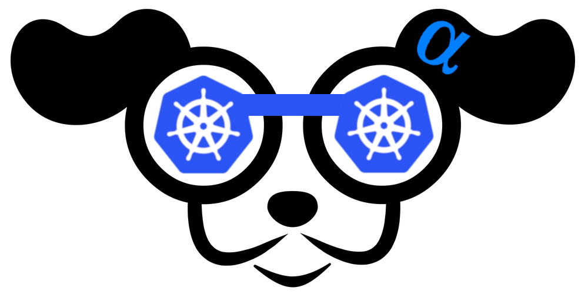

# K9s𝞪

> Kubernetes CLI To Manage Your Clusters In Style!

K9s provides a terminal UI to interact with your Kubernetes clusters.
The aim of this project is to make it easier to navigate, observe and manage
your applications in the wild. K9s continually watches Kubernetes
for changes and offers subsequent commands to interact with your observed resources.

---

 &nbsp;© 2020 Imhotep Software LLC. All materials licensed under [Apache v2.0](http://www.apache.org/licenses/LICENSE-2.0)
