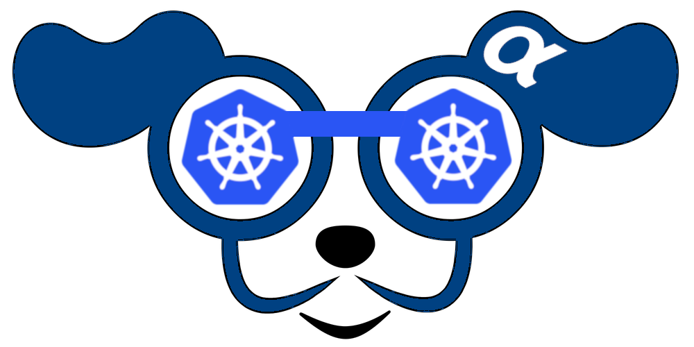

# K9sAlpha - Manage Your Kubernetes Clusters In Style!

From the creators of K9s, comes the next generation of Kubernetes utilities.

K9s𝜶 provides a terminal based CLI to interact with your Kubernetes clusters.
The aim of this project is to make it easier to navigate, observe and manage
your applications in the wild. K9s𝜶 continually watches Kubernetes cluster
for changes and offers subsequent commands to interact with your observed resources.

## Licenses

[Visit Our Store](https://store.k9salpha.io).

## Documentation

[Historical Documents](https://k9salpha.io)

## Videos

- [K9sAlpha-v1.0.0-rc.0](https://youtu.be/hLYK0oPLOIY)
- [K9sAlpha-v1.0.0-rc.1](https://youtu.be/upn-bvFT-ro)

## Contributors

* [Fernand Galiana](https://github.com/imhotepio)
  *   fernand@imhotep.io
  *  [@K9s𝜶](https://twitter.com/k9salpha?lang=en)

 &nbsp;© 2021 Imhotep Software LLC. All materials licensed under [Apache v2.0](http://www.apache.org/licenses/LICENSE-2.0)
