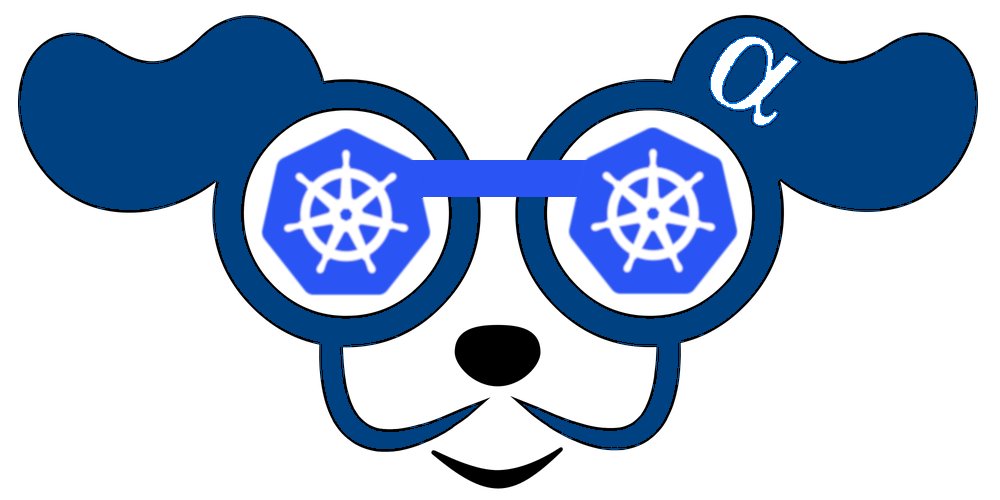
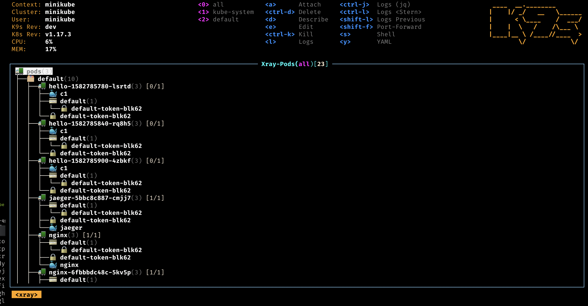
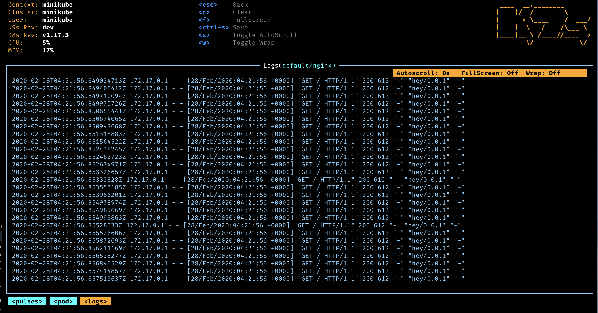

 

# <i class="fas fa-paw"/> Who Let The Pods Out?

> K9sAlpha - Manage Your Kubernetes Clusters In Style!

From the creators of K9s, comes the next generation of Kubernetes utilities.

K9s𝜶 provides a terminal based CLI to interact with your Kubernetes clusters.
The aim of this project is to make it easier to navigate, observe and manage
your applications in the wild. K9s𝜶 continually watches Kubernetes cluster
for changes and offers subsequent commands to interact with your observed resources.

 

# <i class="fas fa-highlighter"/> Features

- Information At Your Finger Tips!
  - Tracks in real-time activities of resources running in your Kubernetes cluster.

- Standard or CRD?
  - Handles both Kubernetes standard resources as well as custom resource definitions.

- Cluster Metrics
  - Tracks real-time metrics associates with resources such as pods, containers and nodes.

- Power Users Welcome!
  - Provides standard cluster management commands such as logs, scaling, port-forwards, restarts...
  - Define your own command shortcuts for quick navigation via command aliases and hotkeys.
  - Plugin support to extend K9sAlpha to create your very own cluster commands.
  - Powerful filtering mode to allow user to drill down and view workload related resources.

- Error Zoom
  - Drill down directly to what's wrong with your cluster's resources.

- Skin-able and Customizable
  - Define your very own look and feel via K9sAlpha skins.
  - Customize/Arrange which columns to display on a per resource basis.

- Narrow or Wide?
  - Provides toggles to view minimal or full resource definitions

- MultiResources Views
  - Provides for an overview of your cluster resources via Pulses and XRay views.

- We've got your RBAC!
  - Supports for viewing RBAC rules such as cluster/roles and their associated bindings.
  - Reverse lookup to asserts what a user/group or ServiceAccount can do on your clusters.

- Built-in Benchmarking
  - You can benchmark your HTTP services/pods directly from K9sAlpha to see how your application fare and adjust your resources request/limit accordingly.

- Resource Graph Traversals
  - K9sAlpha provides for easy traversal of Kubernetes resources and their associated resources.

 

# <i class="fas fa-bullhorn"></i> Get It!

Although, we will continue to support K9s, K9sAlpha contains the next generation of features and enhancements.
To this end, in order to use K9sAlpha, you will need to purchase a license key [here](https://k9salpha.myshopify.com)

 

# <i class="fas fa-book"/> Documentation

* <i class="fas fa-tools"/> [Installation]({{ "/topics/install" }})
* <i class="fas fa-terminal"/> [Commands]({{ "/topics/commands" }})
* <i class="fas fa-car"/> Customizations
  * Feel
    * [Configuration]({{ "/topics/config" }})
    * [Aliases]({{ "/topics/aliases" }})
    * [HotKeys]({{ "/topics/hotkeys" }})
    * [Plugins]({{ "/topics/plugins" }})
    * [Node Shell]({{ "/topics/shell" }})
  * Look
    * [Skins]({{ "/topics/skins" }})
    * [Resource Columns]({{ "/topics/columns" }})
* <i class="fas fa-tachometer-alt"/> [Benchmarking]({{ "/topics/bench" }})
* <i class="fas fa-key"/> [RBAC]({{ "/topics/rbac" }})
* <i class="fas fa-video"/> [Tutorials]({{ "/topics/video" }})

 

## <i class="fab fa-youtube"/> Previews

- Pulses - *A top level dashboard of the state of affairs of your cluster*
  
- XRay - *Dig in your cluster resources and view their dependencies*
  
- Pods - *List out your pods status and resource consumption*
  
- Logs - *View and interact with your container logs*
  
- RBAC - *View the who/what/how of authorizations on your cluster*
  

 

## <i class="fas fa-thumbs-up"></i> ATTA Girls/Boys!

K9s sits on top of many open source projects and libraries. Our *sincere* appreciations to all the OSS contributors that work nights and weekends to make this project a reality!

 

## <i class="fas fa-phone-volume"></i> Get In Touch!

* <i class="fas fa-at fa-2x"/>  [Fernand Galiana](mailto://{{ site.email }})
* <i class="fab fa-twitter fa-2x"/> [@{{ site.twitter }}](https://twitter.com/{{ site.twitter }}?lang=en)
* <i class="fab fa-github fa-2x"/> [K9sAlpha Repo](https://github.com/{{ site.github }})
* <i class="fab fa-slack fa-2x"/>  [K9ers Slack](https://k9sers.slack.com/)
* <i class="fab fa-slack-hash fa-2x"/> [K9ers Slack Invite](https://join.slack.com/t/k9sers/shared_invite/enQtOTA5MDEyNzI5MTU0LWQ1ZGI3MzliYzZhZWEyNzYxYzA3NjE0YTk1YmFmNzViZjIyNzhkZGI0MmJjYzhlNjdlMGJhYzE2ZGU1NjkyNTM)

 

---

  © 2020 Imhotep Software LLC. All materials licensed under

<a class="mid-align" href="http://www.apache.org/licenses/LICENSE-2.0">Apache v2.0</a>
